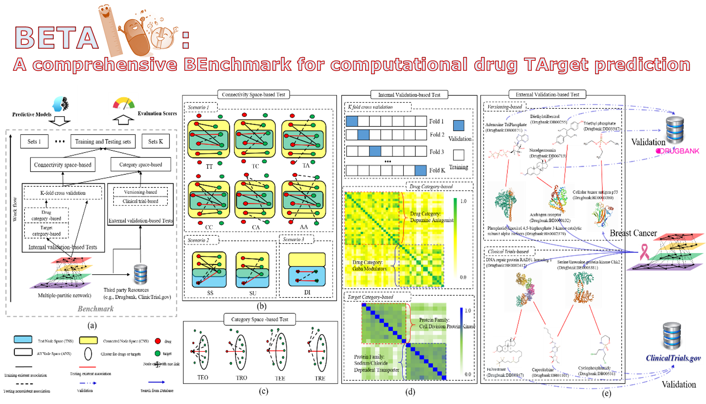
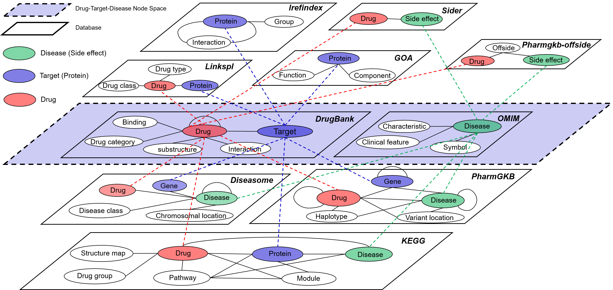
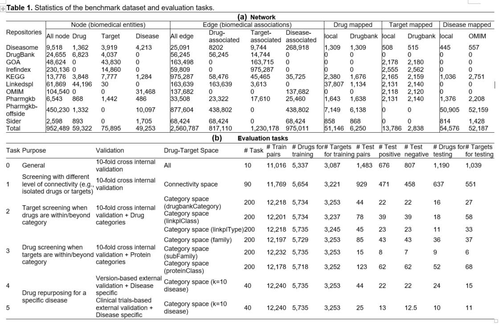
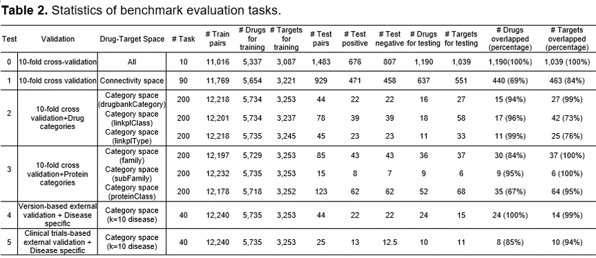

<table border='1' align="center">
<tr>

</tr>
</tabe>

# Objective:   
We provide a large-scale benchmark that enables a comprehensive evaluation of the drug-target predictive models to facilitate a better selection of computational strategies for pre-screening. This benchmark functions are: 

* 1) an extensive multiple-partite network (e.g., 0.95 million biomedical concepts including 59 thousand drugs and 75 thousand targets, and 2.5 million associations including 817 thousand drug-target associations) as well as drug-drug and protein-protein similarities based on drug chemical structures and gene sequences
* 2) a way of comprehensively evaluating strategies that reflect diverse scenarios (a total 1300 tasks across two types of training/testing sampling strategies based on drug-target space as well as five types of validation strategies).  

# Data:
<table border='1' align="center">
<tr>
We constructed a multiple-partite network based on an integration of the existing 9 biomedical repositories (Diseasome, Drugbank, Gene Ontology Annotation (GOA), Interaction Reference Index (iRefindex), Kyoto Encyclopedia of Genes and Genomes (KEGG), Linked Structured Product Label (Linkedspl), Online Mendelian Inheritance in Man (OMIM), Pharmacogenomics Knowledge Base (Pharmgkb), and SIDER) incorporating 952,489 entities and 2,560,787 associations in total (see Table 1) 
</tr>
<tr>

</tr>
<tr>

</tr>
</tabe>

# Benchmark    
<table border='1' align="center">
<tr>
There were five types of evaluation tasks designed based on the different combinations of validation and drug-target space for training and testing (see Table 2).
</tr>
<tr>

</tr>
</tabe>
  
# How to use

## Downlaod the latest benchmark
We have provided three sources for you, 1) benchmark-raw (raw data directly downloaded from each source),  2) benchmark-data (networks, similarity, chemical structure  & gene sequence, and mappings), 3) benchmark-tasks (a total of 1300 tasks). Please follow the path to download the archived benchmark and data. Please note, the archives are encrypted due to the copy-right policy regulated by the licenses (e.g., drugbank). If you want to use data for your study, please contact the author (Zong.nansu@mayo.edu) for decryption.

- [benchmark raw](https://drive.google.com/file/d/1pWBYwhL4W514758r5su2qEQ4v0U_mM8n/view?usp=sharing)		*(These are the raw data)*
- [benchmark data](https://drive.google.com/file/d/11IZSdXXmOsl2uNUg7u9OqRr_UrKCGer3/view?usp=sharing)		*(These are the benchmark data, i.e., networks, similarity, chemical structure  & gene sequence, and mapping)*
- [benchmark tasks](https://drive.google.com/file/d/17OriW3K1PaagUHzkSQWTmB06kV0rMVWw/view?usp=sharing)		*(These are the evaluation tasks in the benchmark)*

## Generate your own version of benchmark
We also provide the codes to enable the generation of your own benchmark. You need to download the data from each database.   

- Data sources: 
   - [DrugBank](https://go.drugbank.com/)
   - [bio2rdf](https://bio2rdf.org/)
   - [DiseaseNetwork](http://networkrepository.com/bio-diseasome.php)
   
- Data download		*(You can reuse the data in the benchmark if you do not need to replace them with the preferred version):*
   - https://bio2rdf.org		*(RDF data of DrugBank, GOA, Irefindex, KEGG, Linkedspl, OMIM, Pharmgkb, Pharmgkb-offside, Sider)*
   - http://networkrepository.com/bio-diseasome.php		*(RDF data of Disease network from diseasome)*
   - https://go.drugbank.com		*(drugbank.xml data contains Drug-target associations from DrugBank)*
   
- Sample data:		(**Note: The sample datasets are used for demonstration of the data format only. Running sample dataset will result in failure of the program**)
   - data_sample/input/done		*(sample raw data)*
   - data_sample/output		*(sample network data and mappings)*
   - data_sample/output/datasets/experiment		*(sample evaluation tasks)*
   - data_sample/output/datasets/orignial		*(sample supplementary data to generate the network and evaluation tasks)*
   
* Data space for the running program
   * data_space/input		*(put raw data here, input path of Render_main.java)*
   * data_space/output		*(generate network data and mappings, output path of Render_main.java)*
   * data_space/output/datasets/orignial		*(put supplementary data, input path of Benchmark_main.java)*
   		* data_space/output/datasets/orignial/drugbank.xml		*(copy drugbank.xml here)*
   		* data_space/output/datasets/orignial/sequence.txt		*(copy gene sequence data here)*
   		* data_space/output/datasets/orignial/smile.xml		*(copy chemical structure data here)*

   
- Environment:
  - Java 1.8
  - Weka 3.8
  - nxparser 2.2
- Maven install:
  - [Maven in eclipse](https://www.vogella.com/tutorials/EclipseMaven/article.html)
- Network generation:
  - Java src/main/Render_main.java		*(running all the data needs approximately 1 hour)*
- Benchmark generation:
  - Java src/main/Benchmark_main.java		*(running all the data needs approximately 3 hours)*
  
# Version
We regularly generate a new version of the benchmark based on the newly released raw data. The current version is 1.0. 
- Version current = 1.0
	- release date: October 10, 2021.
	- specification: bio2redf release 4; Drugbank 5.1.7; ClinicalTrials by Mar 2021
		

# Contact
For help or questions of using the application, please contact Zong.nansu@mayo.edu